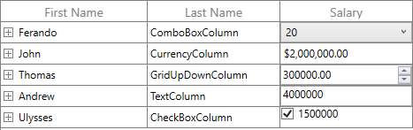

# How to load different cell types for each row based on another column cell value in WPF TreeGrid (SfTreeGrid)?

## About the sample
This example illustrates how to load different cell types for each row based on another column cell value in [WPF TreeGrid](https://www.syncfusion.com/wpf-controls/treegrid) (SfTreeGrid)? 

You can load different controls for each row based on the column value by using **TreeGridTemplateColumn.CellTemplateSelector** in [WPF TreeGrid](https://www.syncfusion.com/wpf-controls/treegrid) (SfTreeGrid).

```XML

<Window.Resources>
        <local:ViewModel x:Key="viewmodel" />
        <local:DataTemplateSelectorExt x:Key="templateselctor"/>
</Window.Resources>
<Grid>
    <Grid.ColumnDefinitions>
         <ColumnDefinition/>
    </Grid.ColumnDefinitions>
   <syncfusion:SfTreeGrid Name="treeGrid"
                               AutoGenerateColumns="False"
                               AllowEditing="True"
                               ItemsSource="{Binding Employees}"
                               ChildPropertyName="ReportsTo"
                               LiveNodeUpdateMode="AllowDataShaping"
                               ParentPropertyName="ID"                               
                               SelfRelationRootValue="-1" >
            <interactivity:Interaction.Behaviors>
                <local:SfTreeGridBehavior/>
            </interactivity:Interaction.Behaviors>
            <syncfusion:SfTreeGrid.Columns>
                <syncfusion:TreeGridTextColumn MappingName="FirstName"
                                               HeaderText="First Name" />
                <syncfusion:TreeGridTextColumn MappingName="LastName" 
                                               HeaderText="Last Name" />
                <syncfusion:TreeGridTemplateColumn HeaderText="Salary" 
                                                   MappingName="Salary"
                                                   CellTemplateSelector="{StaticResource templateselctor}" />
            </syncfusion:SfTreeGrid.Columns>           
   </syncfusion:SfTreeGrid>       
</Grid>

```

The following code explains how different templates are loaded for each row based on the LastName column value.

```C#

public class DataTemplateSelectorExt : DataTemplateSelector
{
        DataTemplate TextBoxTemplate;
        DataTemplate ComboBoxTemplate;
        DataTemplate CheckBoxTemplate;
        DataTemplate CurrencyTemplate;
        DataTemplate UpdownTemplate;
        DataTemplate TextBlockTemplate;

        public DataTemplateSelectorExt()
        {
            TextBlockTemplate = App.Current.Resources["TextBlockTemplate"] as DataTemplate;
            TextBoxTemplate = App.Current.Resources["TextBoxTemplate"] as DataTemplate;
            ComboBoxTemplate = App.Current.Resources["ComboBoxTemplate"] as DataTemplate;
            CheckBoxTemplate = App.Current.Resources["CheckBoxTemplate"] as DataTemplate;
            CurrencyTemplate = App.Current.Resources["CurrencyTemplate"] as DataTemplate;
            UpdownTemplate = App.Current.Resources["UpdownTemplate"] as DataTemplate;
        }

        public override DataTemplate SelectTemplate(object item, DependencyObject container)
        {
            if (item == null)
                return TextBlockTemplate;
            
            //Here customize based on your scenario

            EmployeeInfo orderInfo = item as EmployeeInfo;
            if (orderInfo == null)
                return TextBlockTemplate;

            switch (orderInfo.LastName)
            {
                case "TextColumn":
                    return TextBoxTemplate;
                case "ComboBoxColumn":
                    return ComboBoxTemplate;
                case "CheckBoxColumn":
                    return CheckBoxTemplate;
                case "CurrencyColumn":
                    return CurrencyTemplate;
                case "GridUpDownColumn":
                    return UpdownTemplate;
                default:
                    return TextBlockTemplate;
            }
        }
}

```

The **RecordPropertyChanged** event of data grid is used to update the corresponding values to [TreeGridTemplateColumn](https://help.syncfusion.com/cr/wpf/Syncfusion.UI.Xaml.TreeGrid.TreeGridTemplateColumn.html) when the LastName column value is changed. The **CollectionChanged** event is used to update the values of [TreeGridTemplateColumn](https://help.syncfusion.com/cr/wpf/Syncfusion.UI.Xaml.TreeGrid.TreeGridTemplateColumn.html) based on the LastName column value when a record is added at runtime.

```C#

public class SfTreeGridBehavior : Behavior<SfTreeGrid>
{
        SfTreeGrid treegrid = null;
        protected override void OnAttached()
        {
            treegrid = this.AssociatedObject as SfTreeGrid;
            treegrid.CellRenderers.Remove("Template");
            treegrid.CellRenderers.Add("Template", new TreeGridCellTemplateRenderer());
            treegrid.Loaded += Treegrid_Loaded;
        }

        private void Treegrid_Loaded(object sender, RoutedEventArgs e)
        {
            this.treegrid.View.NodeCollectionChanged += View_NodeCollectionChanged;
            this.treegrid.View.RecordPropertyChanged += View_RecordPropertyChanged1;
        }        

        private void View_RecordPropertyChanged1(object sender, System.ComponentModel.PropertyChangedEventArgs e)
        {           
            var treeGridRowGenerator = this.treegrid.GetTreeGridRowGenerator();

            var treeDataRowBase = treeGridRowGenerator.Items.FirstOrDefault(row => row.RowData == sender);
            if (treeDataRowBase != null)
            {                
                var columns = treeDataRowBase.VisibleColumns as List<TreeDataColumnBase>;
                foreach (var dataColumn in columns.Where(column => column.Renderer != null && column.TreeGridColumn != null))
                {
                    dataColumn.UpdateBinding(sender, false);
                }
            }
        }

        private void View_NodeCollectionChanged(object sender, System.Collections.Specialized.NotifyCollectionChangedEventArgs e)
        {
            if (e.OldItems == null)
                return;
            var rowData = (e.OldItems[0] as TreeNode).Item;
            var treeGridRowGenerator = this.treegrid.GetTreeGridRowGenerator();
            var treeGridDataRowBase = treeGridRowGenerator.Items.FirstOrDefault(row => row.RowData == rowData);
            if (treeGridDataRowBase != null)
            {                
                var columns = treeGridDataRowBase.VisibleColumns as List<TreeDataColumnBase>;
                foreach (var dataColumn in columns.Where(column => column.Renderer != null && column.TreeGridColumn != null))
                {
                    dataColumn.UpdateBinding(rowData, false);
                }
            }
        }       
}

```


The following screenshot shows the different cell types for each row in [WPF TreeGrid](https://www.syncfusion.com/wpf-controls/treegrid) (SfTreeGrid),



Take a moment to peruse the [WPF TreeGrid – TreeGridTemplateColumn](https://help.syncfusion.com/wpf/treegrid/column-type#treegridtemplatecolumn) documentation, where you can find about [TreeGridTemplateColumn](https://help.syncfusion.com/cr/wpf/Syncfusion.UI.Xaml.TreeGrid.TreeGridTemplateColumn.html) with code examples.

## Requirements to run the demo
Visual Studio 2015 and above versions
